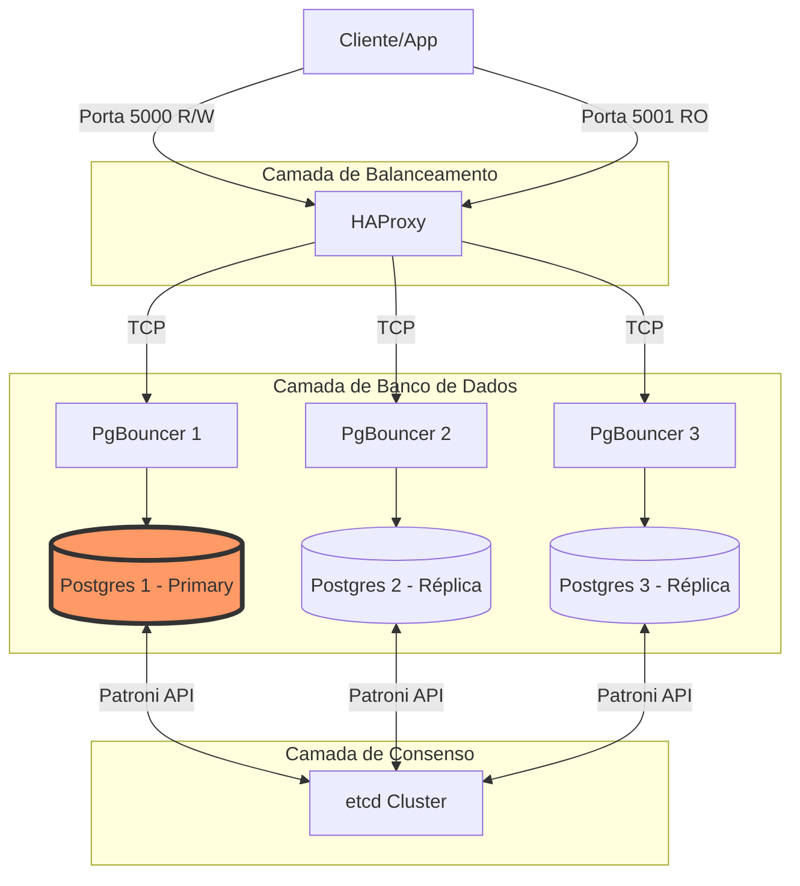

# PostgreSQL High Availability Lab

> **[English](#english)** | **[Portugues](#portugues)**

---

<a name="english"></a>
## English

This project provides a comprehensive, 100% Docker-based laboratory environment for demonstrating PostgreSQL High Availability using a stack composed of Patroni, etcd, PgBouncer, and HAProxy. Designed as a DBRE portfolio piece, it illustrates robust database failover, load balancing, and connection pooling mechanisms without any cloud dependencies.

> **Note:** This project covers High Availability (HA). For Disaster Recovery (DR) and Point-in-Time Recovery (PITR), tools like **pgBackRest** or **Wal-G** would be integrated into this stack to push WALs to S3/MinIO.

### Architecture Overview

The architecture is built around a highly available PostgreSQL cluster managed by Patroni, which uses etcd for distributed consensus and configuration. Client applications do not connect directly to the PostgreSQL nodes. Instead, connections are routed through HAProxy, acting as a load balancer and health checker. HAProxy distributes incoming connections across multiple PgBouncer instances, which provide connection pooling to the PostgreSQL cluster. This setup ensures efficient resource utilization, resilient connections, and seamless failover.

In a failover scenario, Patroni promotes a replica to primary, and all components (PgBouncer and HAProxy) automatically detect this change, redirecting traffic to the new primary.

### Stack/Components

| Component         | Version          | Description                                         |
| :---------------- | :--------------- | :-------------------------------------------------- |
| **PostgreSQL**    | 17               | The relational database system.                     |
| **Patroni**       | Latest stable    | Template for PostgreSQL HA orchestration.           |
| **etcd**          | 3.5.17           | Distributed reliable key-value store for Patroni.   |
| **PgBouncer**     | 1.23.1           | Lightweight connection pooler for PostgreSQL.       |
| **HAProxy**       | Latest LTS       | High performance TCP/HTTP load balancer.            |
| **Docker**        | Latest stable    | Containerization platform.                          |
| **Docker Compose**| Latest stable    | Tool for defining and running multi-container Docker applications. |

### Prerequisites

Before running this lab, ensure you have the following installed:

*   **Docker**: [Install Docker](https://docs.docker.com/get-docker/)
*   **Docker Compose**: Typically included with Docker Desktop installations. If not, [install Docker Compose](https://docs.docker.com/compose/install/)

### Quick Start

1.  **Clone the repository:**
    ```bash
    git clone https://github.com/jean-souto/postgresql-ha-docker.git
    cd postgresql-ha-docker
    ```

2.  **Copy and configure environment variables:**
    ```bash
    cp .env.example .env
    # Edit .env to set your desired passwords if needed
    ```

3.  **Start the services:**
    ```bash
    docker compose up -d
    ```

4.  **Wait for services to become healthy:**
    ```bash
    ./scripts/wait-for-healthy.sh
    ```

    This script will wait until all `pg-N`, `pgbouncer-N`, `etcd-N`, and `haproxy` services report as healthy.

### Architecture Diagram


### Failover Demo


*Automatic failover in action: the primary is killed and a replica is promoted within seconds, with zero data loss.*

### Endpoints

| Port  | Service        | Purpose                                       |
| :---- | :------------- | :-------------------------------------------- |
| 5000  | HAProxy        | Primary Read/Write connections (via PgBouncer) |
| 5001  | HAProxy        | Replica Read-Only connections (via PgBouncer) |
| 7000  | HAProxy        | HAProxy Stats Page (e.g., `http://localhost:7000/stats`) |
| 8008  | Patroni API    | Health checks and cluster state (internal)     |
| 2379  | etcd Client    | Key-value store access (internal)             |
| 5432  | PostgreSQL     | Direct PostgreSQL access (internal to Docker network) |
| 6432  | PgBouncer      | PgBouncer client port (internal to Docker network) |

### Useful Commands

#### Check Cluster Status

```bash
# View cluster members and roles
docker exec pgha-pg-1 patronictl list

# Check replication status
docker exec pgha-pg-1 psql -U postgres -c "SELECT * FROM pg_stat_replication;"

# View Patroni REST API
curl -s http://localhost:8008/cluster | jq
```

#### Health Checks

The `health-check.sh` script provides a quick overview of service health:

```bash
./scripts/health-check.sh
```

#### Stop and Remove Services

To stop and remove all containers, networks, and volumes:

```bash
docker compose down -v
```

### Chaos Testing

The chaos test script validates failover behavior and data integrity:

```bash
# Kill the primary and verify failover
./scripts/chaos-test.sh --kill-primary

# Run full test suite
./scripts/chaos-test.sh --full-test
```

The test performs:
1. Writes test data to the current primary
2. Stops the primary container
3. Waits for a new leader election (typically under 30 seconds)
4. Verifies data integrity on the new primary
5. Restarts the old primary as a replica

Expected results:
- RTO (Recovery Time Objective): Less than 30 seconds
- RPO (Recovery Point Objective): Zero data loss

### Project Structure

```
.
├── .env.example
├── .gitignore
├── docker-compose.yml
├── README.md
├── CHANGELOG.md
├── config/
│   ├── etcd/
│   ├── haproxy/
│   │   └── haproxy.cfg
│   ├── patroni/
│   │   └── patroni.yml.template
│   └── pgbouncer/
│       ├── pgbouncer.ini
│       └── userlist.txt
├── docker/
│   └── patroni/
│       ├── Dockerfile
│       └── entrypoint.sh
├── docs/
└── scripts/
    ├── chaos-test.sh
    ├── health-check.sh
    └── wait-for-healthy.sh
```

### Acknowledgments

This project was developed with the assistance of [Claude Code](https://claude.ai/).

### License

This project is licensed under the MIT License.

---

<a name="portugues"></a>
## Português

Este projeto fornece um ambiente de laboratório completo, 100% baseado em Docker, para demonstrar Alta Disponibilidade do PostgreSQL usando uma stack composta por Patroni, etcd, PgBouncer e HAProxy. Projetado como peça de portfólio para DBRE, ilustra mecanismos robustos de failover de banco de dados, balanceamento de carga e pooling de conexões sem nenhuma dependência de cloud.

> **Nota:** Este projeto cobre Alta Disponibilidade (HA). Para Disaster Recovery (DR) e Point-in-Time Recovery (PITR), ferramentas como **pgBackRest** ou **Wal-G** seriam integradas a esta stack para enviar WALs ao S3/MinIO.

### Visão Geral da Arquitetura

A arquitetura é construída em torno de um cluster PostgreSQL de alta disponibilidade gerenciado pelo Patroni, que usa etcd para consenso distribuído e configuração. Aplicações cliente não se conectam diretamente aos nós PostgreSQL. Em vez disso, as conexões são roteadas através do HAProxy, atuando como balanceador de carga e verificador de saúde. O HAProxy distribui conexões de entrada entre múltiplas instâncias de PgBouncer, que fornecem pooling de conexões para o cluster PostgreSQL. Esta configuração garante utilização eficiente de recursos, conexões resilientes e failover transparente.

Em um cenário de failover, o Patroni promove uma réplica a primary, e todos os componentes (PgBouncer e HAProxy) detectam automaticamente esta mudança, redirecionando o tráfego para o novo primary.

### Stack/Componentes

| Componente        | Versão           | Descrição                                           |
| :---------------- | :--------------- | :-------------------------------------------------- |
| **PostgreSQL**    | 17               | O sistema de banco de dados relacional.             |
| **Patroni**       | Última estável   | Template para orquestração de HA do PostgreSQL.     |
| **etcd**          | 3.5.17           | Armazenamento chave-valor distribuído para Patroni. |
| **PgBouncer**     | 1.23.1           | Pooler de conexões leve para PostgreSQL.            |
| **HAProxy**       | Última LTS       | Balanceador de carga TCP/HTTP de alto desempenho.   |
| **Docker**        | Última estável   | Plataforma de containerização.                      |
| **Docker Compose**| Última estável   | Ferramenta para definir e executar aplicações Docker multi-container. |

### Pré-requisitos

Antes de executar este lab, certifique-se de ter instalado:

*   **Docker**: [Instalar Docker](https://docs.docker.com/get-docker/)
*   **Docker Compose**: Geralmente incluído nas instalações do Docker Desktop. Se não, [instalar Docker Compose](https://docs.docker.com/compose/install/)

### Início Rápido

1.  **Clone o repositório:**
    ```bash
    git clone https://github.com/jean-souto/postgresql-ha-docker.git
    cd postgresql-ha-docker
    ```

2.  **Copie e configure as variáveis de ambiente:**
    ```bash
    cp .env.example .env
    # Edite .env para definir suas senhas desejadas se necessário
    ```

3.  **Inicie os serviços:**
    ```bash
    docker compose up -d
    ```

4.  **Aguarde os serviços ficarem saudáveis:**
    ```bash
    ./scripts/wait-for-healthy.sh
    ```

    Este script aguardará até que todos os serviços `pg-N`, `pgbouncer-N`, `etcd-N` e `haproxy` reportem como saudáveis.

### Diagrama de Arquitetura



### Demo de Failover


*Failover automático em ação: o primary é morto e uma réplica é promovida em segundos, sem perda de dados.*

### Endpoints

| Porta | Serviço        | Propósito                                      |
| :---- | :------------- | :--------------------------------------------- |
| 5000  | HAProxy        | Conexões Primary Leitura/Escrita (via PgBouncer) |
| 5001  | HAProxy        | Conexões Replica Somente Leitura (via PgBouncer) |
| 7000  | HAProxy        | Página de Stats do HAProxy (ex: `http://localhost:7000/stats`) |
| 8008  | Patroni API    | Health checks e estado do cluster (interno)    |
| 2379  | etcd Client    | Acesso ao armazenamento chave-valor (interno)  |
| 5432  | PostgreSQL     | Acesso direto ao PostgreSQL (interno à rede Docker) |
| 6432  | PgBouncer      | Porta cliente do PgBouncer (interno à rede Docker) |

### Comandos Úteis

#### Verificar Status do Cluster

```bash
# Ver membros e funções do cluster
docker exec pgha-pg-1 patronictl list

# Verificar status de replicação
docker exec pgha-pg-1 psql -U postgres -c "SELECT * FROM pg_stat_replication;"

# Ver API REST do Patroni
curl -s http://localhost:8008/cluster | jq
```

#### Health Checks

O script `health-check.sh` fornece uma visão rápida da saúde dos serviços:

```bash
./scripts/health-check.sh
```

#### Parar e Remover Serviços

Para parar e remover todos os containers, redes e volumes:

```bash
docker compose down -v
```

### Teste de Chaos

O script de teste de chaos valida o comportamento de failover e integridade de dados:

```bash
# Matar o primary e verificar failover
./scripts/chaos-test.sh --kill-primary

# Executar suite completa de testes
./scripts/chaos-test.sh --full-test
```

O teste executa:
1. Escreve dados de teste no primary atual
2. Para o container do primary
3. Aguarda uma nova eleição de leader (tipicamente menos de 30 segundos)
4. Verifica integridade dos dados no novo primary
5. Reinicia o antigo primary como réplica

Resultados esperados:
- RTO (Recovery Time Objective): Menos de 30 segundos
- RPO (Recovery Point Objective): Zero perda de dados

### Estrutura do Projeto

```
.
├── .env.example
├── .gitignore
├── docker-compose.yml
├── README.md
├── CHANGELOG.md
├── config/
│   ├── etcd/
│   ├── haproxy/
│   │   └── haproxy.cfg
│   ├── patroni/
│   │   └── patroni.yml.template
│   └── pgbouncer/
│       ├── pgbouncer.ini
│       └── userlist.txt
├── docker/
│   └── patroni/
│       ├── Dockerfile
│       └── entrypoint.sh
├── docs/
└── scripts/
    ├── chaos-test.sh
    ├── health-check.sh
    └── wait-for-healthy.sh
```

### Agradecimentos

Este projeto foi desenvolvido com a assistência do [Claude Code](https://claude.ai/).

### Licença

Este projeto está licenciado sob a Licença MIT.
